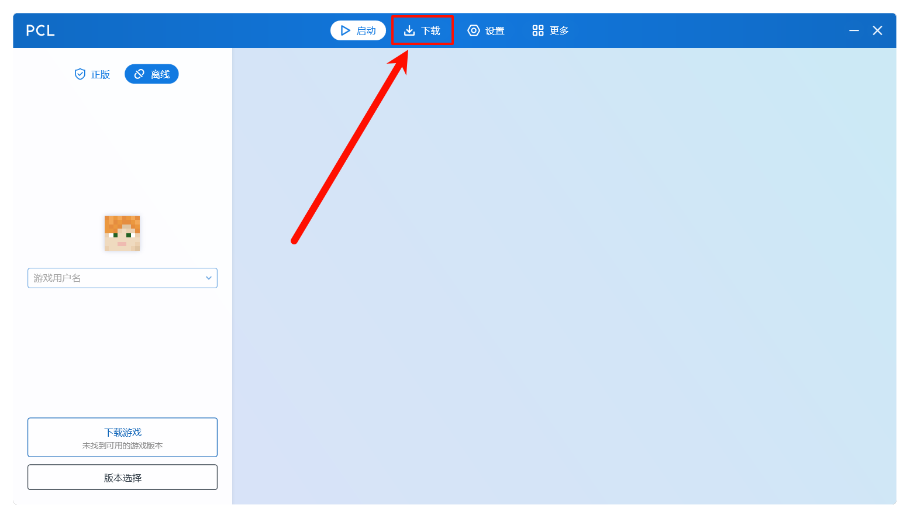
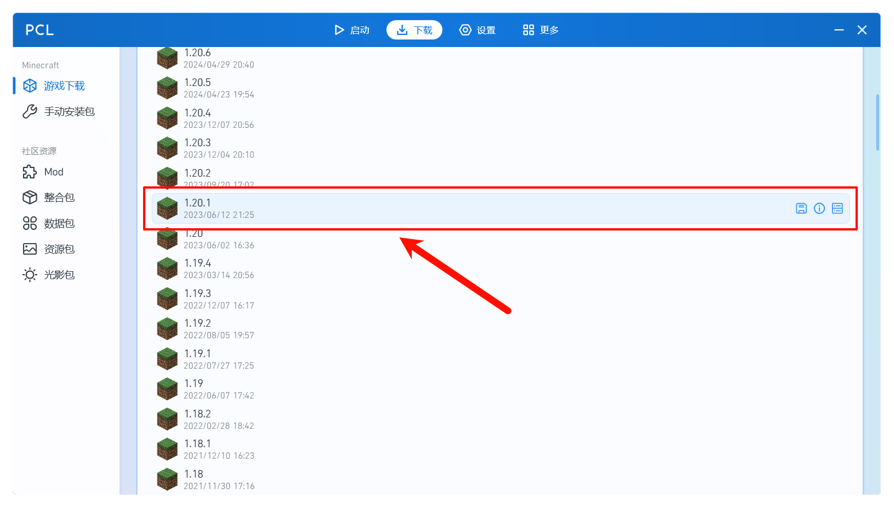
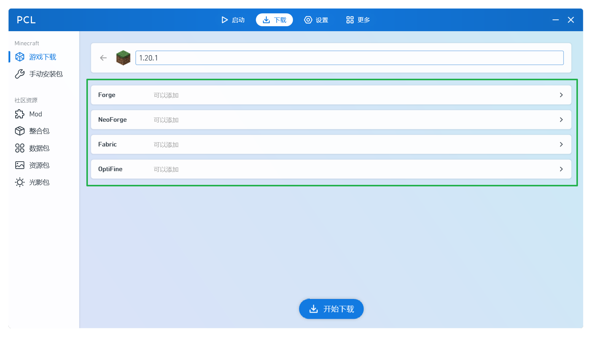
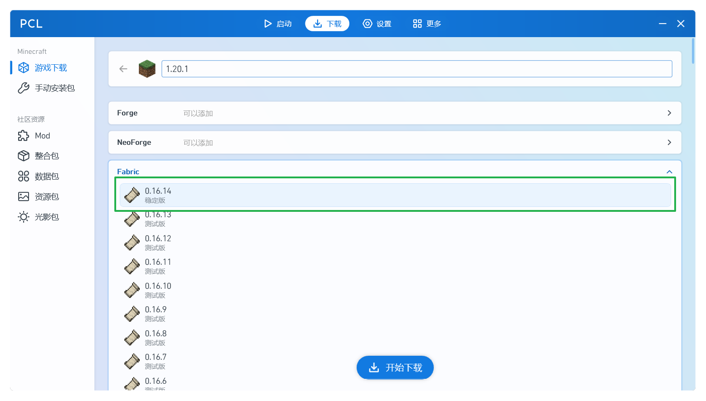
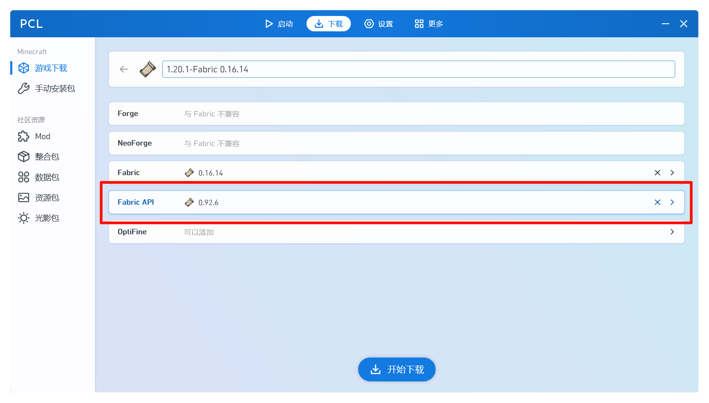
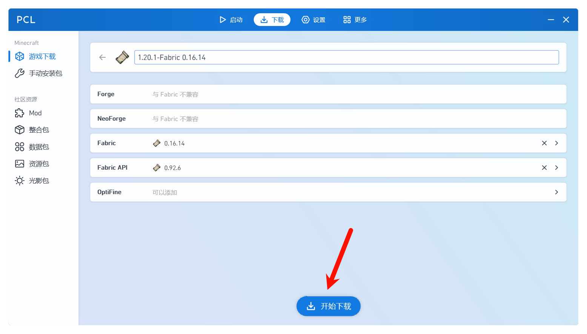

# 模组加载器安装

本篇将会教会你如何适用第三方启动器在安装游戏的时候，自动安装你的游戏模组加载器。

## 安装模组加载器

首先，你要明白一点，模组加载器是通过修改游戏的源文件来实现模组加载的，一般来说，可以在现有的游戏中安装加载器，也可以在一个全新的游戏中安装加载器。

本篇提供两种安装方式，分别是 **在现有游戏上安装加载器** 和 **全新安装游戏和加载器** 两种方式，当然我们更加推荐适用后者，因为步骤少，环境干净，更适合我们。

## 全新安装游戏和加载器

我们先来看看如何 **全新安装游戏和加载器**，这是最简单也是最干净的方式。

打开你的 PCL2 启动器，在上方的标签栏中选择 **下载**：

这就是 PCL 2 启动器的下载页面，我们先选择一个你想要安装模组加载器的版本，我们这边以 1.20.1 为例，因为 1.20.1 在高版本中模组百花齐放，点开正式版本，找到 1.20.1 ，点开它：

最上面是游戏名称，你可以任意更改这个游戏名字，只要认得出来就好。发现在版本号下面，有很多可选项目，他们就是**模组加载器**：

选择一个你在前文选择的加载器，以 **Fabric** 为例，你会发现他会有很多版本，我们按理来说选择**最新版本**即可：

这时候，启动器会弹出来个 **Fabric API**，这是 **Fabric 模组**使用的加载器 API，模组在**调用加载器**的时候就需要用到 Fabric API，我们依旧选择最新版本即可：

这个时候，点击底部的开始下载，**PCL 2 启动器就会帮你下载好游戏资源，自动帮你安装好模组加载器**。*无需担心，喝杯茶就好了）*

## 疑难解答

### 下载游戏失败？

可能是镜像站或者官方资源站繁忙，也可能是你的网络不行。更换网络或者稍后再试。

### 模组加载器下载失败？

网络不行。更换网络或者稍后再试。

### 模组加载器安装失败？

多试几次。*就是这样（）稍安勿躁（）*

### 进游戏后在左下角没有出现修改信息？

请确保你正确选择加载器版本，再试一次。

## 启动游戏

回到主页，在左下角 版本选择 里面，选择刚刚安装好的版本，再点击主页的启动游戏即可。

进游戏后，主界面的左下角应该会写出当前加载器类型和加载器版本，如果有，那么恭喜你，正确安装了带有模组加载器的版本啦！

## 关于手动安装模组加载器

**在现有游戏上安装加载器** 就是手动安装模组加载器，我们并不推荐初来乍到的你们这么去做。无论是步骤还是不确定因素太多了……

乖，听话 ~ 我们选择上面的自动安装会更好，知道不 ~

祝你有一个美好的游戏时光，去看下一章吧 ~
